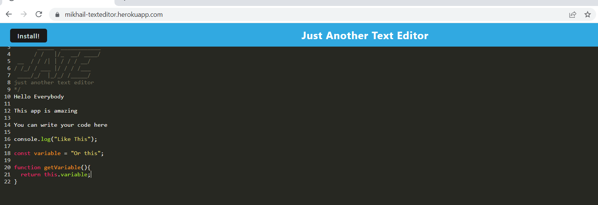

# Hw19-TextEditor

### This is Mikhail Sookwah's project about creating a textEditor webapp

This program includes:

* Entering your text from the browser

* It autosaves even if you exit the application and

* Can be downloaded and installed on your computer by using the installation icon

----------------------------------------------------------------

[Link to the GitHub page](https://github.com/Mikhail25/Hw19-TextEditor)

[Link to the Heroku App](https://mikhail-texteditor.herokuapp.com/)